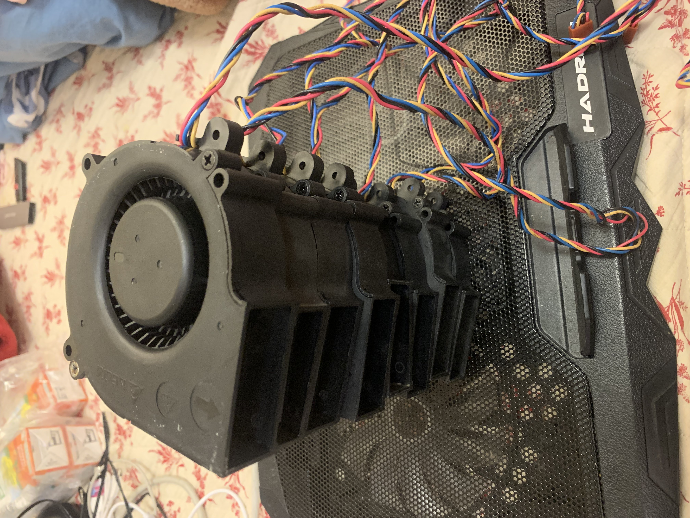
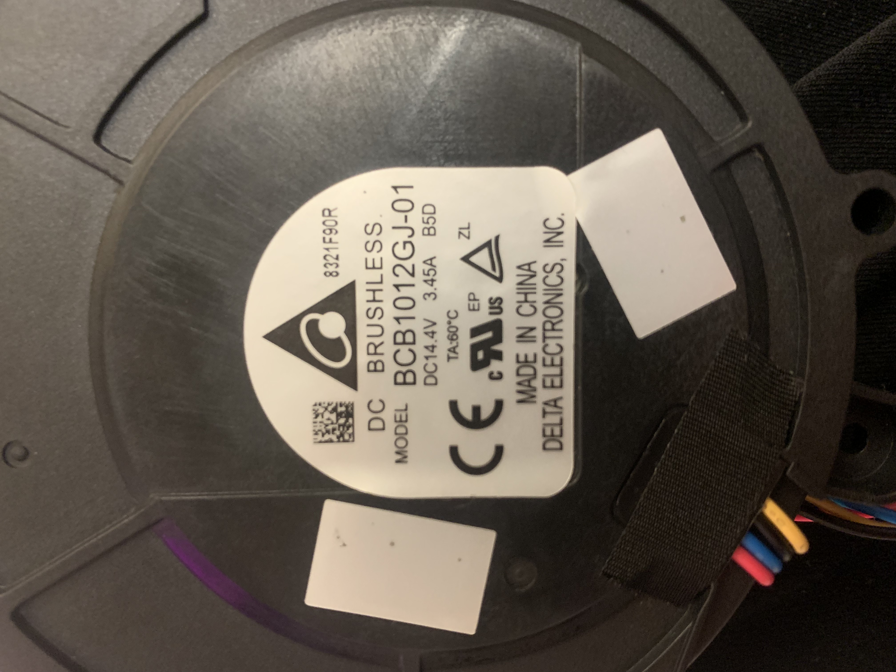

# Delta BCB1012GJ-01 Brushless DC Centrifugal Blower

OEM suction/fan motor pulled from Neato Botvac D3 / D3 Pro / D4 / D5 / D6 / D7 robot vacuums. Manufactured by **Delta Electronics, Inc.** (Taiwan). Now used in the [ROVAC v2 chassis migration](../../docs/v2_chassis_migration/vacuum_subsystem.md) — Layout B1 dual-pair pancake.

> **Quantity in inventory:** 8 motors received 2026-05-05. Sourced from eBay seller `bluecloud22`, ~$22 total (~$2.75/ea after bulk discount). All marked as "Used / Pre-owned" but seller claims "fully functional".



---

## Confidence legend

Throughout this document, every spec is tagged with a confidence marker so you can instantly see what's verified vs. what's inferred:

| Marker | Meaning |
|---|---|
| ✅ | **Verified from physical label or photograph of our actual motors** |
| 📜 | **Verified from a Delta-issued datasheet or distributor spec sheet** |
| 🔬 | **Field-verified by a third party** (e.g. teardown forum thread, with citation) |
| 📐 | **Computed from confirmed values** (Ohm's law, fan affinity laws, etc.) |
| 🔭 | **Inferred from the sister model BCB1012UH** (12 V 2-wire variant in the same housing) |
| ⚠️ | **Estimated from class/family** — least reliable, treat as upper/lower bound only |
| 📏 | **TO BE MEASURED on bench** — placeholder for Mohammed to fill in once motors are in hand |

---

## 1. Identification

| Field | Value | Confidence |
|---|---|---|
| Manufacturer | Delta Electronics, Inc. | ✅ Label |
| Manufacturer category | DC Brushless Centrifugal Blower (BCB family) | ✅ Label / family naming convention |
| Model (MPN) | **BCB1012GJ-01** | ✅ Label |
| Variant marker | B5D | ✅ Label (Delta-internal grade/build code, not publicly documented) |
| Date / lot code | 8321F90R | ✅ Label (interpretation: probably year-week 2018-W32 build, lot 1F90R — Delta's exact format isn't published) |
| Customer / OEM application | Neato Robotics Botvac D3 / D3 Pro / D4 / D5 / D6 / D7 | ✅ eBay listing, multiple cross-references |
| Country of origin | China | ✅ Label "MADE IN CHINA" |
| Certifications on label | cULus (UL+CSA), CE, EP (probably ErP), ZL | ✅ Label |
| Operating temperature | TA: 60 °C (max ambient) | ✅ Label |
| Lifecycle | Active, third-party stocked (e.g. `elecok`, `pchub`) — unlikely to be in Delta's current public catalog | 🔭 Inference from market |



### Naming convention decoded
Delta blower names follow a (mostly) consistent pattern:
- `BCB` — Brushless Centrifugal Blower (single-inlet scroll housing)
- `1012` — housing size class (≈100 mm × 12 mm reference, but in practice this family is the 97 × 25 mm scroll-cage class)
- `GJ` — variant code (impeller pitch + winding combo)
- `-01` — customer/OEM revision (the "-01" almost always means "Neato-specific build" for this part)

The closest publicly-catalogued sibling is **BCB1012UH** (12 V, 2-wire, server cooling) — which we use as the performance reference below.

---

## 2. Electrical specifications

### Confirmed from label
| Parameter | Value | Confidence |
|---|---|---|
| Rated voltage | **DC 14.4 V** | ✅ Label `DC14.4V` |
| Rated current | **3.45 A** | ✅ Label `3.45A` |
| Rated power | **49.7 W** | 📐 `14.4 V × 3.45 A = 49.7 W` |
| Motor type | Brushless DC with integrated ESC (3-phase commutation handled inside the housing) | ✅ Label "DC BRUSHLESS" + presence of 4-wire harness |
| Operating voltage range | **~9 V to ~16 V** | 🔭 BCB1012UH (12 V variant) is rated 6–13.2 V; scaling to the 14.4 V class gives ~9–16 V |
| Locked-rotor protection | Yes (industry-standard for the BCB family) | 🔭 BCB1012UH has it; consistent across the BCB1012 family |
| Max ambient temperature | 60 °C | ✅ Label `TA:60°C` |
| Bearing | Ball (likely dual ball, sleeve possible on cheaper variants) | 🔭 BCB1012UH is dual-ball; OEM Neato use case implies long-life ball bearings |
| Expected life @ 40 °C | ~50,000 hours | 🔭 BCB1012UH spec; ball-bearing centrifugal blowers in this class typically rate 40k–80k h |

### Estimated performance (from voltage scaling of BCB1012UH @ 12 V)
The published specs for the public sister part (BCB1012UH at 12 V, 2-wire) are:
- 35.3 CFM (1.0 m³/min) free-air flow
- 1009.6 Pa (4.05 inH₂O) maximum static pressure
- 67.8 dB(A) noise
- 3.20 A current at 12 V (38.4 W)

Applying fan affinity laws (volumetric flow ∝ RPM, pressure ∝ RPM², power ∝ RPM³) and assuming RPM scales roughly linearly with voltage in this BLDC class:

| Parameter | BCB1012UH @ 12 V (📜 published) | BCB1012GJ-01 @ 14.4 V (📐 scaled) | Confidence of scaled value |
|---|---|---|---|
| RPM (free-air) | ~13,000–14,000 (typical for class) | ~15,500–17,000 | ⚠️ |
| Free-air flow | 35.3 CFM | **~42 CFM** (1.2 m³/min, ~20 L/s) | 🔭 |
| Max static pressure | 1009.6 Pa | **~1,450 Pa** | 🔭 |
| Noise | 67.8 dB(A) | ~70–72 dB(A) | ⚠️ |
| Power input | 38.4 W | 49.7 W | ✅ Label-matched |

**Caveats on scaled values:**
1. The `-GJ-` variant indicates a different impeller pitch/winding than `-UH-`, so scaling-from-UH likely **understates** the GJ-01's pressure performance and **overstates** its noise.
2. The Neato D7 (which uses this exact motor) is rated by the manufacturer for ~2,000 Pa system suction — that's higher than my scaled 1,450 Pa estimate, which is consistent with the GJ-01 being a higher-pressure variant than the UH.
3. Real-world performance against system back-pressure (cyclone + HEPA + ducting) will be much lower than the free-air numbers.

### Computed limits
| Parameter | Value | Notes |
|---|---|---|
| Inrush current peak | ~5–7 A for ~50–100 ms | 📐 Typical 1.5–2× rated for BLDC with integrated ESC + electrolytic capacitor inrush |
| Steady-state DC bus capacitance suggested | ≥220 µF / 25 V per motor | 📐 Standard rule of thumb; smooths the brief commutation ripple |
| Recommended fuse | 5 A slow-blow per motor (or 20 A on a shared 4-motor bus) | 📐 Mohammed's `vacuum_subsystem.md` already specs 20 A automotive blade fuse |
| UVLO concern | At ~9 V the motor cuts out | 🔭 Don't run from a sagging Li-ion 4S below ~13 V under load |

---

## 3. Mechanical specifications

### Housing dimensions (overall)
| Dimension | Value | Confidence |
|---|---|---|
| Length × Width × Height | **97 × 87 × 25 mm** | 📜 elecok.com / pchub.com listings of this exact MPN; consistent with photos |
| Closest sibling overall (UH) | 97.2 × 94.4 × 25 mm | 📜 Lisleapex / Avaq |
| Approximate volume | ~210 cm³ | 📐 |
| Estimated weight | ~110–140 g per motor | ⚠️ Class estimate; 📏 TBD by Mohammed |
| Housing material | **PBT-GF30-FR** (PBT + 30% glass fiber, flame retardant UL94 V-0) | ✅ Visible molding mark in elecok product photo (page 2 of `datasheets/elecok_product_page_BCB1012GJ-01.pdf`) |
| Impeller type | Centrifugal, single-inlet (axial intake → radial exhaust through tangential scroll) | ✅ Photo |
| Mounting tabs visible | 3 tabs on the housing perimeter (each with an M3-class through-hole) | ✅ Photo |
| Exhaust port (rectangular outlet) | ~25 × 14 mm | ⚠️ Rough estimate from the existing `vacuum_subsystem.md`; 📏 TBD by Mohammed |

### Things to physically measure (📏 TBD)
These should be measured before printing any 3-D adapters or manifold parts:

- [ ] Exact length × width × height with a caliper (verify the 97 × 87 × 25 mm claim)
- [ ] Exact diameter of the round intake (top/bottom face)
- [ ] Exact rectangular exhaust port: width × height, and the distance from the housing edge
- [ ] Mounting hole pattern: number of holes, hole diameter, PCD (pitch-circle diameter) and angular spacing
- [ ] Distance from each mounting hole to the impeller centre
- [ ] Total weight of one motor (digital scale)
- [ ] Connector type: pitch (1.5 mm? 2.0 mm? 2.5 mm?), orientation, locking style
- [ ] Wire gauge (likely 26 AWG or 24 AWG)

A small `MEASUREMENTS.md` companion file or an addition to this document under a "Measured by Mohammed (2026-05-XX)" section is the recommended way to record those numbers — they unblock CAD work for the inter-stage manifold.

### Available 3-D models
**No public CAD model found** for the BCB1012GJ-01. Searched:
- Delta Electronics official site (no CAD downloads for OEM-only variants)
- GrabCAD (only generic "Delta blower" parts, no BCB1012 family match)
- Thingiverse (no match)
- Manufacturer catalog PDFs (no DXF/STEP for this MPN)

**Recommended path:** caliper-measure on arrival, then either:
1. Model as a parametric OpenSCAD primitive (preferred — the existing v2 work uses OpenSCAD), or
2. Photogrammetry / 3-D scan one motor with a phone app (Polycam, KIRI Engine — both work on iPhone)

---

## 4. Pinout — 4-wire harness 🔬

The BCB1012GJ-01 uses a **4-pin / 4-wire** harness, ~150 mm long. Wire colour mapping was field-verified by Neato D7 owners on the Robot Reviews forum (full thread saved at `datasheets/robotreviews_d7_fan_pinout_thread_2020.pdf`).

| Wire colour | Function | Direction | Notes |
|---|---|---|---|
| 🔴 **Red** | V+ (battery, +14.4 V) | Power in | High-current line; this is where the 3.45 A flows |
| ⚫ **Black** | GND | Power return | High-current line. **In the OEM Neato wiring, this goes through a shunt resistor + small N-MOSFET (BSS138) for current monitoring** — bypass it if you're driving the motor standalone |
| 🟡 **Yellow** | **PWM input** (speed setpoint) | Input to motor | 5 V logic, ~25 kHz PWM (industry standard for Delta BCB family). Internal pull-up — **floating yellow ⇒ motor runs at 100 % default speed** |
| 🔵 **Blue** | **FG / tach output** (RPM feedback) | Output from motor | Open-collector pulse train. **Needs an external pull-up** (4.7 kΩ–10 kΩ to 3.3 V or 5 V) on the host side. Industry standard is 2 pulses per revolution |

### Notes on the pinout (very important — read this before wiring)

1. **The colour mapping is the OPPOSITE of the PC-fan industry standard.** A standard 4-wire PC fan has Yellow=Tach, Blue=PWM. **Delta's BCB family for Neato uses the REVERSE: Yellow=PWM, Blue=Tach.** Don't trust muscle-memory if you're used to PC fans.
2. **Floating PWM ≠ off.** If you cut the yellow wire and leave it open, the motor runs at full speed (because the internal pull-up wins). The Neato controller actively pulls the yellow line LOW to command "off". This was the failure mode in the linked forum thread — the broken Neato mainboard couldn't release the PWM line.
3. **The black wire on the OEM Neato connector is NOT a clean ground.** Neato passes the motor return current through a shunt resistor and a low-side MOSFET (their main fan-control element) before reaching battery negative. If you reuse the OEM connector pinout but bypass the Neato mainboard, you must connect the motor's black wire **directly to battery negative** — not to where the Neato connector pin used to go.
4. **Tach pulses per revolution:** I've assumed the standard 2 PPR. Verify on bench with an oscilloscope or a frequency counter once you have one running. If it's actually 4 PPR (some Delta variants), all RPM calculations need to be halved.

### Pin-numbering on the connector
The 4-pin connector is visible in the elecok photos (`datasheets/elecok_product_page_BCB1012GJ-01.pdf` page 2). Pin order, looking at the connector with the latch facing up and the wires entering from the back:

| Pin # | Wire | Function |
|---|---|---|
| 1 | 🔴 Red | V+ |
| 2 | ⚫ Black | GND |
| 3 | 🟡 Yellow | PWM in |
| 4 | 🔵 Blue | FG out |

This is the **standard Delta BCB-family pinout**. The Neato mainboard side likely follows the same pin order, but **always verify with a multimeter against the V+ pin before plugging in** if you ever connect a motor to a non-confirmed connector.

### Connector type
**Most likely:** JST PH 2.0 mm 4-pin (or possibly XH 2.5 mm 4-pin). 📏 verify on arrival with calipers — the choice between PH and XH affects the cable assembly you need to source.

---

## 5. PWM control characteristics

| Parameter | Value | Confidence |
|---|---|---|
| Logic level | 5 V tolerant input (3.3 V drives correctly via internal level shifter) | 🔭 Class standard for Delta BCB |
| PWM frequency | ~25 kHz nominal | 🔭 Class standard; Delta datasheets for BFB sister family confirm 25 kHz ±10 % |
| Acceptable PWM frequency range | ~20 kHz – 30 kHz | 🔭 |
| Duty-cycle to speed mapping | Approximately linear above ~20 % duty (below 20 % the motor is in "off" or hysteresis region) | 🔬 Forum thread (jdredd ran 6,000–7,000 RPM at reduced voltage; Neato firmware default reportedly ~90 % duty) |
| Floating input behaviour | Internal pull-up → motor runs at 100 % | 🔬 Forum thread (D7 hack worked by leaving PWM disconnected) |
| Logic-low input behaviour | Motor stops | 🔬 Forum thread |
| Required source impedance | <10 kΩ; an MCU GPIO drives this directly | 🔭 |
| Sense of duty cycle | **Higher duty = higher speed** (Delta PWM is "duty-following", not inverted like some Intel CPU fans) | 🔭 BCB1012UH derivative; if it ever turns out to be inverted, this is the FIRST thing to check |

### How to drive PWM from a microcontroller
**ESP32 (which is what ROVAC uses):**
```c
// LEDC at 25 kHz, 10-bit resolution (1024 steps)
ledc_timer_config_t timer = {
    .duty_resolution = LEDC_TIMER_10_BIT,
    .freq_hz         = 25000,
    .speed_mode      = LEDC_LOW_SPEED_MODE,
    .timer_num       = LEDC_TIMER_0,
};
ledc_timer_config(&timer);

ledc_channel_config_t channel = {
    .channel    = LEDC_CHANNEL_0,
    .duty       = 0,             // start stopped
    .gpio_num   = GPIO_NUM_25,   // any free output GPIO
    .speed_mode = LEDC_LOW_SPEED_MODE,
    .hpoint     = 0,
    .timer_sel  = LEDC_TIMER_0,
};
ledc_channel_config(&channel);

// To set 60% duty:
ledc_set_duty(LEDC_LOW_SPEED_MODE, LEDC_CHANNEL_0, 614);   // 614/1023 ≈ 60%
ledc_update_duty(LEDC_LOW_SPEED_MODE, LEDC_CHANNEL_0);
```

**Arduino (Uno / Nano):** Hardware PWM tops out around 980 Hz on `analogWrite()` — too slow; use `Timer1` library or a Timer2 prescaler hack to reach 25 kHz. The motor *will* run at ~1 kHz PWM but with audible whine.

---

## 6. FG (tach) signal characteristics

| Parameter | Value | Confidence |
|---|---|---|
| Output type | Open-collector / open-drain (NPN to GND inside motor) | 🔭 Class standard |
| Pulses per revolution (PPR) | **2 PPR** (assumed industry standard); 📏 verify on scope | 🔭 |
| External pull-up needed | 4.7 kΩ – 10 kΩ to 3.3 V or 5 V (the motor sinks; you supply the high level) | 🔭 |
| Frequency at full speed (~17 k RPM, 2 PPR) | ~570 Hz | 📐 `RPM × PPR / 60` |
| Frequency at idle (5 k RPM, 2 PPR) | ~167 Hz | 📐 |
| Duty cycle of FG pulses | ~50 % (square-wave-ish) | 🔭 |
| Hall sensor source | Internal Hall on rotor magnet | 🔭 |

### Reading FG with an MCU
Wire FG to a GPIO that supports edge interrupts or input capture:

```c
// ESP32 PCNT (pulse counter) approach — measures pulses over a window
pcnt_unit_config_t cfg = {
    .high_limit = INT16_MAX,
    .low_limit  = INT16_MIN,
};
pcnt_unit_handle_t pcnt = NULL;
pcnt_new_unit(&cfg, &pcnt);

pcnt_chan_config_t ch_cfg = {
    .edge_gpio_num  = GPIO_NUM_26,    // FG wire (with 4.7k pull-up to 3.3V)
    .level_gpio_num = -1,
};
pcnt_channel_handle_t ch;
pcnt_new_channel(pcnt, &ch_cfg, &ch);
pcnt_channel_set_edge_action(ch, PCNT_CHANNEL_EDGE_ACTION_INCREASE, PCNT_CHANNEL_EDGE_ACTION_HOLD);
pcnt_unit_enable(pcnt);
pcnt_unit_start(pcnt);

// Read every 100 ms, RPM = (count / 0.1s) * 60 / PPR
```

**Stuck-fan detection:** If the FG count is zero over 1 s while PWM duty is non-zero, the motor is jammed (pre-stage clog, dead bearing, or rotor lockout) — cut PWM to 0 and raise an error. This is exactly what the Neato firmware does.

---

## 7. Safety and operating notes

1. ⚠️ **Never run debris through the impeller.** A pre-stage cyclone OR a coarse mesh filter is mandatory. Hard particles (gravel, hair clips, etc.) will destroy the impeller blades within minutes.
2. ⚠️ **Heat:** at full load (49.7 W) the motor is mostly cooled by the air it's pumping. If you stall the airflow (block the inlet or outlet) for more than ~10 s while running, the windings overheat. The 60 °C `TA` rating is for ambient; case temperature can be much higher.
3. ⚠️ **Inrush current:** budget 5–7 A peak per motor for ~50–100 ms at startup. Don't share a single MOSFET high-side switch across all 4 motors without a soft-start, or you'll trip your battery's BMS.
4. ⚠️ **Bearing vibration:** these are centrifugal blowers — the impeller is a heavy-ish spinning mass. Mount on sorbothane pads (already specced in `docs/v2_chassis_migration/shopping_list.md`) to avoid coupling vibration into the chassis (and confusing the BNO055 IMU).
5. ⚠️ **Used / pre-owned:** ours came from a Neato bin-pull. Bench-test each motor for at least 60 s at full PWM before committing it to a build — listen for bearing roughness, smell for burnt windings.

---

## 8. Bench verification recipe (do this first, before mounting any motor)

This is the recommended pre-flight before integrating any of the 8 motors. It takes ~5 minutes per motor.

### Equipment
- 14.4 V bench supply with current limit (or a 4S Li-ion pack with a fuse)
- Multimeter (continuity + DC voltage)
- Logic analyser **or** oscilloscope (any USB scope with 1 MS/s is fine)
- 4.7 kΩ resistor (for the FG pull-up)
- ESP32 dev board or Arduino with a 25 kHz PWM output

### Step 1 — Confirm pinout (per motor)
With the motor **unpowered**, use the multimeter in continuity mode:
- Black ↔ all visible metal on the motor body → should beep (GND is bonded to chassis)
- Red ↔ Black → should NOT beep (no internal short)
- Yellow / Blue → no continuity to anything else

### Step 2 — Power-on smoke test
With current-limited supply set to 5 A:
- Connect Red→V+, Black→GND only (leave Yellow + Blue floating)
- Apply 14.4 V
- **Expected:** motor spins up to full speed within ~1 s (because PWM is internally pulled high). Steady-state current ~3.0–3.5 A. No smoke, no burnt smell, no scraping.
- If current is >5 A or motor doesn't spin up cleanly, mark this motor BAD and try the next one.

### Step 3 — Identify the PWM line
With motor still running:
- Pull Yellow to GND with a clip lead
- **Expected:** motor stops immediately. (If it doesn't stop, Yellow is not the PWM line — the colour code may be batch-different.)
- Release: motor restarts.
- Now pull Blue to GND.
- **Expected:** motor keeps running. (If pulling Blue stops it, the Blue/Yellow are reversed compared to forum data.)

### Step 4 — Verify FG (tach) signal
- Stop motor (Yellow to GND)
- Wire the FG line to your scope/logic analyser via the 4.7 kΩ pull-up to 3.3 V
- Release Yellow → motor spins up
- **Expected:** square-ish wave on the FG line, ~500–600 Hz at full speed

### Step 5 — Calibrate PPR (do this once for one motor; assume the rest are identical)
- Drive PWM at a few known duty cycles (25 %, 50 %, 75 %, 100 %)
- Measure FG frequency at each
- If you have a tachometer or a phototach, cross-check actual RPM
- Record `RPM = FG_freq × 60 / PPR` and solve for `PPR` (should come out exactly 2; if it's 4 or 1, all later RPM calcs need to be adjusted)

### Step 6 — Record the per-motor results
Make a small table somewhere (top of this README is fine, or a separate `MEASUREMENTS.md`). Per-motor info worth recording:
- Serial / date code from label
- Pass/fail of smoke test
- Idle current at floating PWM (full-speed free-air)
- Stalled current (briefly block inlet → measure peak)
- Subjective bearing noise: smooth / slight wobble / grinding

That table tells you which 4 of your 8 motors are best-of-breed for the Layout B1 build, vs which 4 to keep as spares.

---

## 9. Application guide — using these in other electronics / robotics projects

The BCB1012GJ-01 is a high-pressure, moderate-flow blower. Its strengths and weaknesses determine where it shines:

### Good fits
- **Robot vacuum suction stages** (its native application — high pressure for picking up debris through restrictive ducting)
- **3-D printer enclosure exhaust** with a HEPA cartridge (49 W is plenty for a 60-litre printer chamber; the high static pressure handles the cartridge restriction)
- **Spot ventilation** for soldering / resin printing fume extraction at short duct runs
- **Compact air-curtains** (multiple motors arranged in a slot)
- **Cyclonic dust collection** for benchtop CNC / mini-mill (single motor, with a cyclone)
- **Pneumatic actuators** at low pressure (1–1.5 kPa is enough for paper-pickup grippers, soft robots, etc.)
- **Cooling boost on heat sinks** when you need pressure to push through dense fins (more useful than a regular axial fan for tightly-pitched fins ≥ 25 fpi)

### Poor fits
- **Inflatable structures or high-volume pneumatics** (these don't move enough air — only ~20 L/s free-air; you want a ducted axial fan instead)
- **Quiet applications** (centrifugal blowers at 17k RPM are loud — ~70 dB(A) is conversation-level)
- **Constant 24/7 operation** (50k h life is good but not legendary; better to use a dedicated server fan if you need years of duty)
- **Battery-tight builds** (49.7 W per motor is a lot for a small Li-ion pack; rough rule: each motor pulls 3.5 % of a 4S 5 Ah pack per minute at full speed)

### Wiring for a generic ESP32-driven application

```
                ┌──────────────────┐
                │                  │
   ┌────►Red────┤ V+ (14.4 V)     │
   │            │                  │
   ├──◄►Black──┤ GND              │     BCB1012GJ-01
   │            │                  │
   │  GPIO────►Yellow (PWM in)     │
   │            │                  │
   │  GPIO◄────Blue  (FG out)──┐   │
   │            │              │   │
   │            └──────────────│───┘
   │                           │
   │       4.7 kΩ pull-up      │
   └─────►3.3 V────/\/\/\─────┘
```

For a cleaner integration:
- A **logic-level N-MOSFET on the high side** of V+ for emergency cut-off (don't trust software-only control with a 3.45 A motor)
- A **TVS diode** (e.g. SMAJ18CA) across V+/GND for inductive kickback if you switch the motor's V+ rapidly
- A **220 µF / 25 V electrolytic** between V+ and GND, near the motor connector

---

## 10. References / sources

| # | Source | Why it matters | Local file |
|---|---|---|---|
| 1 | **Physical label** on motor #1 | Voltage, current, model number, B5D variant | [`photos/bottom_label_close_up.jpeg`](photos/bottom_label_close_up.jpeg) |
| 2 | **eBay listing** (`bluecloud22`) | Original purchase, "Used / OEM" provenance, $4.99 each | [`datasheets/ebay_listing_bluecloud22_2026-05-05.pdf`](datasheets/ebay_listing_bluecloud22_2026-05-05.pdf) |
| 3 | **elecok.com** product page | Confirmed dimensions 97 × 87 × 25 mm and harness 150 mm 4-wire 4-pin | [`datasheets/elecok_product_page_BCB1012GJ-01.pdf`](datasheets/elecok_product_page_BCB1012GJ-01.pdf) |
| 4 | **lisleapex.com** product page (BCB1012UH sister) | Sister-model dimensions (97 × 94 × 25 mm) | [`datasheets/lisleapex_product_page_BCB1012UH_sister_part.pdf`](datasheets/lisleapex_product_page_BCB1012UH_sister_part.pdf) |
| 5 | **Avaq.com** product page (BCB1012UH sister) | Sister-model performance specs (35.3 CFM, 1009.6 Pa, 50k h life, 67.8 dB) | [`datasheets/avaq_product_page_BCB1012UH_sister_part.pdf`](datasheets/avaq_product_page_BCB1012UH_sister_part.pdf) |
| 6 | **Robot Reviews forum thread** (D7 fan teardown, Dec 2019) | **Field-verified 4-wire pinout, internal pull-up behaviour, Neato low-side current sense topology** | [`datasheets/robotreviews_d7_fan_pinout_thread_2020.pdf`](datasheets/robotreviews_d7_fan_pinout_thread_2020.pdf) |
| 7 | Delta BFB1012EH-C18J datasheet (PDF) | Sister BFB-family datasheet — useful as a template for what a real Delta BCB datasheet would contain | https://www.delta-fan.com/Download/Spec/BFB1012EH-C18J.pdf |
| 8 | Delta DC Brushless fans catalogue | Manufacturer's official catalogue (no public BCB1012GJ-01 entry) | https://www.deltaww.com/en-US/products/ctmPages/dcfans_main |

### Related ROVAC documents
- [`docs/v2_chassis_migration/vacuum_subsystem.md`](../../docs/v2_chassis_migration/vacuum_subsystem.md) — Layout B1 plan that uses 4 of these 8 motors
- [`docs/v2_chassis_migration/shopping_list.md`](../../docs/v2_chassis_migration/shopping_list.md) — bill of materials including these motors
- [`docs/v2_chassis_migration/decisions.md`](../../docs/v2_chassis_migration/decisions.md) — D7 / D8 / D9 architecture decisions on the vacuum subsystem
- [`hardware/README.md`](../README.md) — master hardware index
